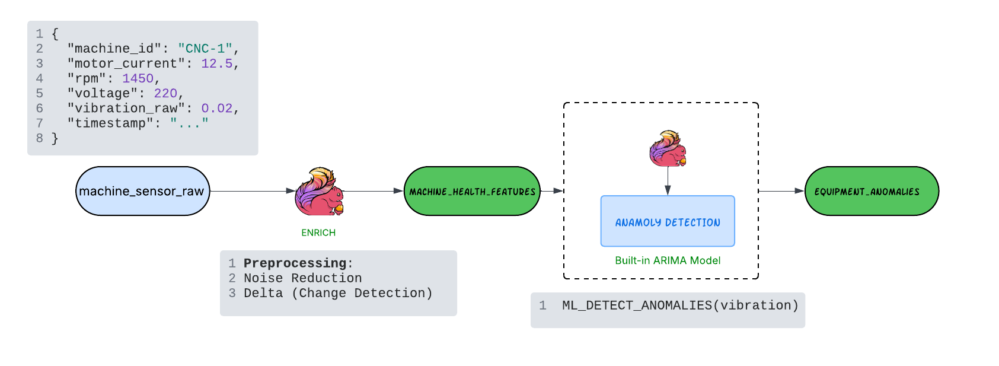
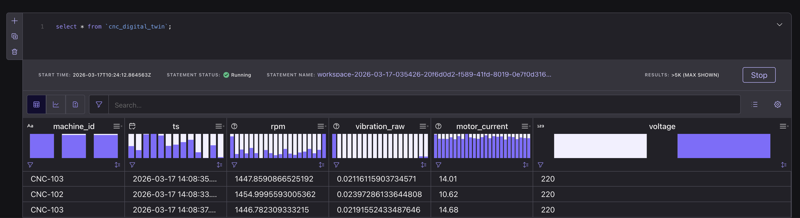

# Lab: Predictive Maintenance for Precision Manufacturing Using Confluent Intelligence

This demo showcases a **real-time predictive maintenance system** that continuously monitors CNC machine health, detects abnormal behavior patterns, and flags potential equipment failures before they occur.

Built on **Confluent Cloud for Apache Flink**, the system processes sensor telemetry from CNC machines in real time and applies **built-in ML anomaly detection** to identify early signs of **bearing degradation or spindle failure**.

The goal is to move from **reactive maintenance** to **predictive maintenance**, reducing costly downtime and improving operational efficiency.

---

# Business Context

**Global Precision Machining (GPM)** operates hundreds of CNC machines across its manufacturing facilities.

Currently, maintenance is performed **reactively**, meaning machines are repaired only after failures occur. A single **spindle failure costs approximately $65,000** due to production downtime, emergency repair, and lost throughput.

To reduce these losses, GPM is implementing **predictive maintenance** by streaming sensor data from CNC machines and detecting anomalies in real time.

---

# The Use Case: CNC Machine Anomaly Detection

The system observes **multiple interconnected machine signals**:

* **Motor Current**
* **Spindle RPM**
* **Vibration**

These signals together provide insight into **machine health and bearing wear**. Subtle deviations in their patterns can indicate problems long before a failure occurs.

By analyzing these signals continuously, the system can:

1. Detect **abnormal vibration patterns**
2. Identify **unexpected current spikes**
3. Observe **RPM instability**

These early warning signals allow maintenance teams to intervene **before a spindle failure occurs**.

---

# Architecture Overview

The streaming architecture follows three main stages:

1. **Sensor Data Generation** – Simulated CNC machine telemetry is produced as a real-time stream.
2. **Feature Transformation** – Raw sensor signals are cleaned and enriched to generate health metrics.
3. **Anomaly Detection** – Flink’s built-in ML functions detect abnormal machine behavior.

The result is a continuous stream of **equipment anomaly alerts** for maintenance teams.



---

# Prerequisites

Install the following tools:

**MacOS**

```bash
brew install uv git python
brew tap hashicorp/tap
brew install hashicorp/tap/terraform
brew install --cask confluent-cli docker-desktop
```

**Windows**

```powershell
winget install astral-sh.uv Git.Git Docker.DockerDesktop Hashicorp.Terraform ConfluentInc.Confluent-CLI Python.Python
```

---

# Deploy the Demo

Clone the repository:

```bash
git clone https://github.com/confluentinc/quickstart-streaming-agents.git
cd quickstart-streaming-agents
```

Run the deployment script:

```bash
uv run deploy
```

Choose the **Predictive Maintenance Lab** when prompted.

---

# Use Case Walkthrough

## Part 1 — Understanding the Data (Pre-Built)

In this lab, the raw data pipeline is already set up for you.

Behind the scenes:

- A **Flink source** generates CNC machine telemetry  
- A **digital twin transformation** simulates realistic machine behavior  

---

### 🔍 Explore the Data

Let’s take a look at the live stream of machine data:

```sql
SELECT * FROM cnc_machine_signals;
```




Each event represents telemetry from a CNC machine. Below is an example event :

```json
{
 "machine_id": "CNC-1",
 "motor_current": 11.33,
 "rpm": 1453.3511458792168,
 "voltage": 220,
 "vibration_raw": 0.022443748602164096,
 "ts": "..."
}
```


These values simulate readings from real sensors attached to CNC machines.

---

# Part 2 — Sensor Feature Transformation

Raw telemetry often contains noise. Before applying anomaly detection, we perform **light preprocessing**.

Transformations include:

- Noise Reduction / Smoothing
- Change detection using delta values

Run the following query in your SQL Workspace and let's create an enriched stream:

```sql
CREATE TABLE machine_health_features AS
SELECT
    machine_id,
    ts,
    vibration_raw,
    -- Smoothing: Average of the last 10 rows
    AVG(vibration_raw) OVER (
        PARTITION BY machine_id 
        ORDER BY ts 
        ROWS BETWEEN 10 PRECEDING AND CURRENT ROW
    ) AS vibration_smoothed,
    (rpm / NULLIF(motor_current, 0)) AS efficiency_index
FROM cnc_machine_signals;
```
This step generates **derived features** that improve anomaly detection accuracy.

---

# Part 3 — Detect Machine Anomalies

Now we apply **Flink’s built-in ML anomaly detection function** to detect abnormal vibration patterns.

The algorithm continuously learns the expected behavior of each machine and flags deviations.

f(x) = vibration

Run the following query in the Flink SQL workspace:

```sql
SELECT
    machine_id,
    ts,
    vibration_raw,
    vibration_smoothed,
    efficiency_index,
    ML_DETECT_ANOMALIES(
        vibration_smoothed,
        ts,
        JSON_OBJECT(
            'p'               VALUE 1,
            'q'               VALUE 1,
            'd'               VALUE 1,
            'minTrainingSize' VALUE 50,
            'maxTrainingSize' VALUE 300,
            'evalWindowSize'  VALUE 20,
            'horizon'         VALUE 5,
            'enableStl'       VALUE FALSE
        )
    ) OVER (
        PARTITION BY machine_id
        ORDER BY ts
        RANGE BETWEEN UNBOUNDED PRECEDING AND CURRENT ROW
    ) AS anomaly
FROM machine_health_features;
```

### What this does

For each machine:

* Maintains a **rolling history of sensor readings**
* Builds a statistical model of expected vibration
* Detects deviations from normal patterns

If vibration rises unexpectedly relative to historical behavior, the system flags an **anomaly event**.

---


# Creating a Continuous Anomaly Detection Job

Next, convert the query into a streaming job that emits **only anomalous machine behavior**.

```sql
CREATE TABLE equipment_anomalies AS
SELECT
    machine_id,
    timestamp,
    vibration,
    anomaly_score
FROM (
    SELECT
    machine_id,
    ts,
    vibration_raw,
    vibration_smoothed,
    efficiency_index,
    ML_DETECT_ANOMALIES(
        vibration_smoothed,
        ts,
        JSON_OBJECT(
            'p'               VALUE 1,
            'q'               VALUE 1,
            'd'               VALUE 1,
            'minTrainingSize' VALUE 50,
            'maxTrainingSize' VALUE 300,
            'evalWindowSize'  VALUE 20,
            'horizon'         VALUE 5,
            'enableStl'       VALUE FALSE
        )
    ) OVER (
        PARTITION BY machine_id
        ORDER BY ts
        RANGE BETWEEN UNBOUNDED PRECEDING AND CURRENT ROW
    ) AS anomaly
FROM machine_health_features;
)
WHERE anomaly_score.is_anomaly = TRUE;
```

This table continuously outputs **detected machine anomalies**.

---

# Viewing the Results

Run:

```sql
SELECT * FROM equipment_anomalies;
```

You will see records whenever a machine shows **abnormal vibration behavior**.

Example:

| Machine | Timestamp | Vibration | Anomaly |
| ------- | --------- | --------- | ------- |
| CNC-1   | 12:41:02  | 0.18      | TRUE    |

This could indicate:

* Bearing wear
* Spindle imbalance
* Tool misalignment

Maintenance teams can act **before a catastrophic failure occurs**.

---

# Benefits of This Architecture

This streaming predictive maintenance system enables:

• **Early detection of machine degradation**
• **Reduced unplanned downtime**
• **Lower maintenance costs**
• **Improved production reliability**

For GPM, preventing even **one spindle failure** saves approximately **$65,000**.

---

# Conclusion

By combining **real-time streaming, feature transformation, and ML-based anomaly detection**, we built a predictive maintenance pipeline capable of monitoring CNC machines continuously.

Instead of reacting to failures, manufacturers can now **anticipate problems and schedule maintenance proactively**.

This architecture demonstrates how **Confluent Cloud + Apache Flink** can power intelligent industrial monitoring systems.

---

