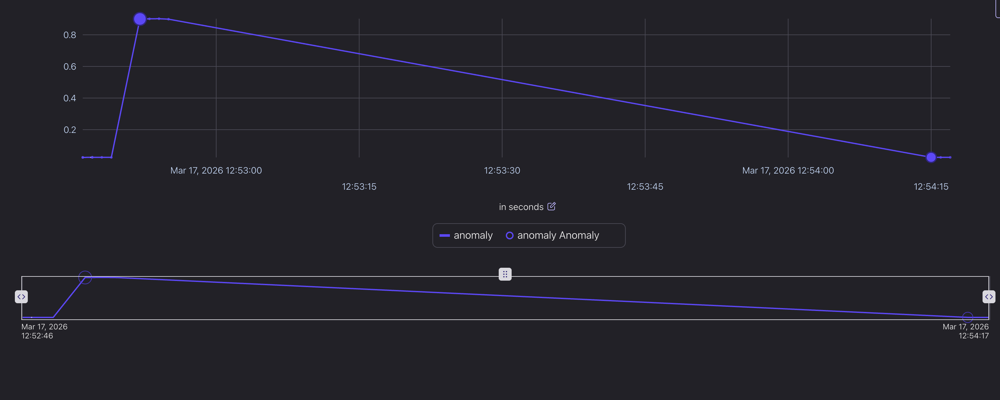

# Lab 1: Predictive Maintenance for CNC Machines

This lab builds a real-time anomaly detection pipeline for CNC machine telemetry using `ML_DETECT_ANOMALIES` in Confluent Cloud for Apache Flink.


Simulated sensor data (motor current, RPM, vibration) streams through three stages: raw telemetry from CNC machines → smoothed health features → per-machine anomaly detection. The goal is catching early signs of bearing wear or spindle failure before they cause downtime.

---

## Deploy the Demo

Clone the repository:

```bash
git clone https://github.com/confluentinc/quickstart-streaming-agents.git
cd quickstart-streaming-agents
```

Run the deployment script:

```bash
uv run deploy lab1
```

---

## Walkthrough

### 1. Understanding the Data

The raw data pipeline is already set up — a Faker connector streams CNC machine telemetry into `cnc_machine_signals`. Explore it in the Flink SQL workspace:

```sql
SELECT * FROM cnc_machine_signals;
```


Example event:

```json
{
 "machine_id": "CNC-1",
 "motor_current": 11.33,
 "rpm": 1453.3511458792168,
 "voltage": 220,
 "vibration_raw": 0.022443748602164096,
 "ts": "..."
}
```

---

### 2. Sensor Feature Transformation

Before running anomaly detection, smooth the raw vibration signal and compute an efficiency index. Run the following in the Flink SQL workspace:

```sql
CREATE TABLE machine_health_features AS
SELECT
    machine_id,
    ts,
    vibration_raw,
    -- Smoothing: Average of the last 10 rows
    AVG(vibration_raw) OVER (
        PARTITION BY machine_id
        ORDER BY ts
        ROWS BETWEEN 10 PRECEDING AND CURRENT ROW
    ) AS vibration_smoothed,
    (rpm / NULLIF(motor_current, 0)) AS efficiency_index
FROM cnc_machine_signals;
```

---

### 3. Detect Machine Anomalies

Run the following in the Flink SQL workspace. `ML_DETECT_ANOMALIES` trains an independent ARIMA model per machine and flags rows where smoothed vibration falls outside the predicted range.

```sql
CREATE TABLE equipment_anomalies AS
SELECT
    machine_id,
    ts,
    vibration_smoothed,
    anomaly
FROM (
    SELECT
        machine_id,
        ts,
        vibration_raw,
        vibration_smoothed,
        efficiency_index,
        ML_DETECT_ANOMALIES(
            vibration_smoothed,
            ts,
            JSON_OBJECT(
                'p'               VALUE 1,
                'q'               VALUE 1,
                'd'               VALUE 1,
                'minTrainingSize' VALUE 50,
                'maxTrainingSize' VALUE 300,
                'evalWindowSize'  VALUE 20,
                'horizon'         VALUE 5,
                'enableStl'       VALUE FALSE
            )
        ) OVER (
            PARTITION BY machine_id
            ORDER BY ts
            RANGE BETWEEN UNBOUNDED PRECEDING AND CURRENT ROW
        ) AS anomaly
    FROM machine_health_features
)
WHERE anomaly.is_anomaly = TRUE;
```



Query the results:

```sql
SELECT * FROM equipment_anomalies;
```

| Machine | Timestamp | Vibration | Anomaly |
| ------- | --------- | --------- | ------- |
| CNC-01  | 12:41:02  | 0.18      | TRUE    |
| CNC-09  | 12:45:59  | 0.35      | TRUE    |

Anomalies can indicate bearing wear, spindle imbalance, or tool misalignment.

---

## Navigation

- **← Back to Overview**: [Main README](./README.md)
- **→ Next Lab**: [Lab 2](./Lab2-Walkthrough.md)
- **🧹 Cleanup**: Run `uv run destroy`
