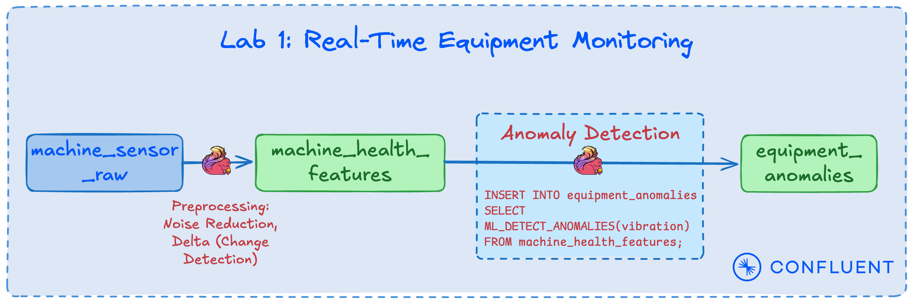
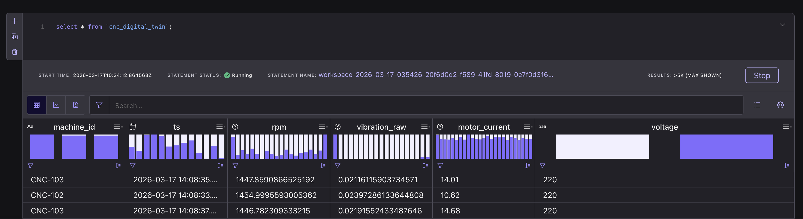
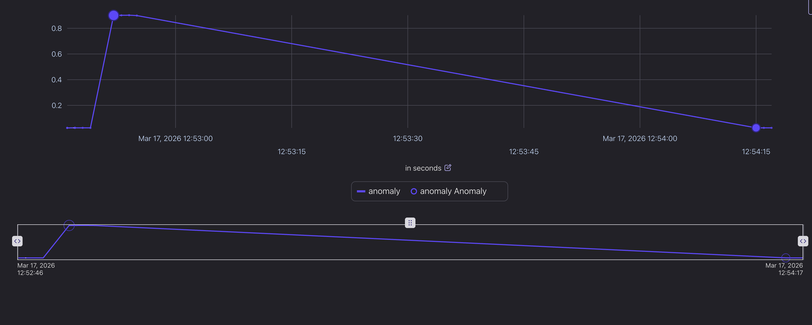

# Lab 1: Predictive Maintenance for CNC Machines

This lab builds a real-time anomaly detection pipeline for CNC machine telemetry using `ML_DETECT_ANOMALIES` in Confluent Cloud for Apache Flink.



Simulated sensor data (motor current, RPM, vibration) streams through three stages: raw telemetry from CNC machines → windowed health features → per-machine anomaly detection. The goal is catching early signs of bearing wear or spindle failure before they cause downtime.

---

## Prerequisites

**Required accounts & credentials:**

[](https://www.confluent.io/get-started/)

<details>
<summary>Install the Prerequisities (Mac/Windows)</summary>

**Mac:**

```bash
brew install uv git python && brew tap hashicorp/tap && brew install hashicorp/tap/terraform && brew install --cask confluent-cli
```

**Windows:**

```powershell
winget install astral-sh.uv Git.Git Hashicorp.Terraform ConfluentInc.Confluent-CLI Python.Python
```

</details>

---

## Deploy the Demo

Clone the repository:

```bash
git clone https://github.com/confluentinc/quickstart-ai-ml-functions.git
cd quickstart-ai-ml-functions
```

Run the deployment script:

```bash
uv run deploy
```

> **Optional:** Register the project-scoped Confluent MCP server in Claude or Codex:
>
> ```bash
> uv run setup-mcp
> ```

---

## Walkthrough

### 1. Understanding the Data

The raw data pipeline is already set up — a Faker connector streams CNC machine telemetry into `cnc_machine_signals`. Explore it in the Flink SQL workspace:

```sql
SELECT * FROM cnc_machine_signals;
```



Example event:

```json
{
 "machine_id": "CNC-1",
 "motor_current": 11.33,
 "rpm": 1453.3511458792168,
 "voltage": 220,
 "vibration_raw": 0.022443748602164096,
 "ts": "..."
}
```

---

### 2. Sensor Feature Engineering

Before running anomaly detection, aggregate the raw signals into 5-second tumbling windows per machine. `ML_DETECT_ANOMALIES` works best on an evenly spaced series with one value per timestamp, and tumbling windows produce exactly that — while also computing health features like average vibration, peak vibration, and an efficiency index. Run the following in the Flink SQL workspace:

```sql
CREATE OR ALTER MATERIALIZED TABLE machine_health_features AS
SELECT
    machine_id,
    window_time AS ts,
    AVG(vibration_raw) AS vibration_avg,
    MAX(vibration_raw) AS vibration_peak,
    AVG(rpm / NULLIF(motor_current, 0)) AS efficiency_index
FROM TUMBLE(TABLE cnc_machine_signals, DESCRIPTOR(ts), INTERVAL '5' SECOND)
GROUP BY machine_id, window_start, window_end, window_time;
```

---

### 3. Detect Machine Anomalies

Run the following in the Flink SQL workspace. `ML_DETECT_ANOMALIES` trains an independent ARIMA model per machine and flags windows where average vibration falls outside the predicted confidence interval. Detection begins once a machine has accumulated 50 windows (about 4 minutes of data).

```sql
CREATE OR ALTER MATERIALIZED TABLE equipment_anomalies AS
SELECT
    machine_id,
    ts,
    vibration_avg,
    anomaly.is_anomaly,
    anomaly.forecast_value,
    anomaly.lower_bound,
    anomaly.upper_bound
FROM (
    SELECT
        machine_id,
        ts,
        vibration_avg,
        ML_DETECT_ANOMALIES(
            vibration_avg,
            ts,
            JSON_OBJECT(
                'minTrainingSize'      VALUE 50,
                'maxTrainingSize'      VALUE 300,
                'confidencePercentage' VALUE 99.9
            )
        ) OVER (
            PARTITION BY machine_id
            ORDER BY ts
            RANGE BETWEEN UNBOUNDED PRECEDING AND CURRENT ROW
        ) AS anomaly
    FROM machine_health_features
)
WHERE anomaly.is_anomaly = TRUE
  AND vibration_avg > anomaly.upper_bound;
```



Query the results:

```sql
SELECT * FROM equipment_anomalies;
```

| Machine | Timestamp | Vibration | Is Anomaly | Forecast | Lower Bound | Upper Bound |
| ------- | --------- | --------- | ---------- | -------- | ----------- | ----------- |
| CNC-101 | 12:41:54  | 0.90      | true       | 0.10     | -0.65       | 0.85        |
| CNC-103 | 12:45:54  | 0.89      | true       | 0.09     | -0.64       | 0.84        |

Anomalies can indicate bearing wear, spindle imbalance, or tool misalignment.

---

## Navigation

- **← Back to Overview**: [Main README](./README.md)
- **→ Next Lab**: [Lab 2](./Lab2-Walkthrough.md)
- **🧹 Cleanup**: Run `uv run destroy`
