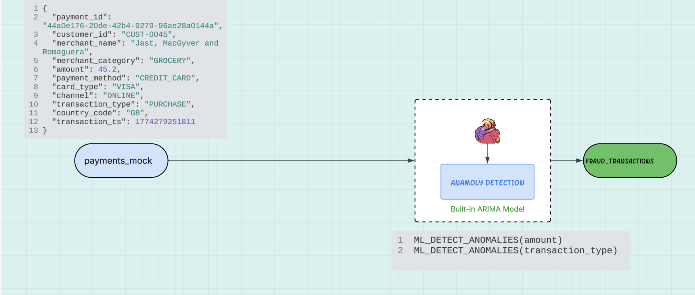
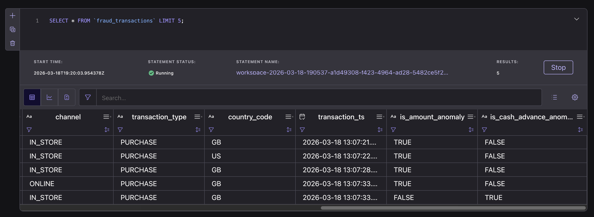

# Lab 2: Real-Time Payment Fraud Detection with `ML_DETECT_ANOMALIES`

This lab demonstrates a **real-time payment fraud detection pipeline** that continuously monitors customer transactions, detects anomalous behavior patterns, and flags potential fraud before financial losses occur.

Built on **Confluent Cloud for Apache Flink**, the system processes synthetic payment events in real time and applies **built-in ML anomaly detection** to identify unusual transaction amounts and suspicious cash advance activity — per customer.

[Learn more about the built-in anomaly detection functions on Confluent Cloud for Apache Flink.](https://docs.confluent.io/cloud/current/ai/builtin-functions/detect-anomalies.html)

---

# Business Context

**FinSecure Payments** processes millions of card transactions daily across 50+ markets.

Currently, fraud detection runs on **batch rules** with fixed thresholds — meaning fraud is often detected hours after it occurs, and genuine customers are blocked by false positives.

To reduce fraud losses and improve customer experience, FinSecure is implementing **real-time per-customer anomaly detection** by streaming transaction events through Confluent Cloud and applying online ARIMA models that learn each customer's individual spending baseline.

---

# The Use Case: Per-Customer Payment Anomaly Detection

The system monitors **two interconnected fraud signals** per customer:

* **Transaction amount spikes** — unusually large purchases relative to a customer's history
* **Cash advance spikes** — sudden increases in `CASH_ADVANCE` activity above a customer's baseline

These signals together reveal suspicious behavior patterns that fixed rules miss. By modeling each customer individually, the system:

1. Detects **outlier transaction amounts** that deviate from personal spending norms
2. Identifies **cash advance surges** that suggest account compromise
3. Emits fraud alerts in **real time** — not hours later

---

# Architecture Overview

The streaming architecture follows three main stages:

1. **Data Generation** – Synthetic payment events are produced continuously via the Flink faker connector.
2. **Anomaly Detection** – Two per-customer ARIMA models run in parallel on amount and transaction type signals.
3. **Fraud Output** – Flagged transactions are written to the `fraud_transactions` table, backed by a Kafka topic.



---

# Prerequisites

Install the following tools:

**MacOS**

```bash
brew install uv git python
brew tap hashicorp/tap
brew install hashicorp/tap/terraform
brew install --cask confluent-cli
```

**Windows**

```powershell
winget install astral-sh.uv Git.Git Hashicorp.Terraform ConfluentInc.Confluent-CLI Python.Python
```

---

## Deploy the Demo

```bash
uv run deploy lab2
```

This provisions the core Confluent Cloud environment, along with the `payments_mock` source table, which uses the [Flink faker connector](https://docs.confluent.io/cloud/current/flink/how-to-guides/custom-sample-data.html)generating ~10 synthetic payment records per second across 50 customers.

## Walkthrough

### Data Generation

The `payments_mock` topic uses the [Flink faker connector](https://docs.confluent.io/cloud/current/flink/how-to-guides/custom-sample-data.html) to generate 10 payment records per second across 50 customers. The synthetic data stream contains two financial fraud signals, which we aim to detect with `ML_DETECT_ANOMALIES`:

- **Transaction size spikes:** ~0.5% of transactions have an amount of `$8,750` (vs. a normal range of `$12.50`–`$110.75`)
- **Cash advance spikes:** `CASH_ADVANCE` transaction type appears at ~10% baseline; per-customer spikes above that baseline over a rolling time window are flagged

### 1. Create the `fraud_transactions` Table

Open a SQL workspace in the [Confluent Cloud Flink UI](https://confluent.cloud/go/flink), select your environment and compute pool, and run the following query.

Two `ML_DETECT_ANOMALY` models run per customer — one on transaction amount, one on transaction type. Anytime either model detects fraud, it emits an anomaly event to the`fraud_transactions` topic. 

```sql
CREATE TABLE fraud_transactions AS
WITH with_anom AS (
  SELECT
    p.*,
    
    ML_DETECT_ANOMALIES(
      CAST(amount AS DOUBLE), transaction_ts,
      JSON_OBJECT(
        'minTrainingSize' VALUE 10,
        'confidencePercentage' VALUE 99.0,
        'enableStl' VALUE FALSE
      )
    ) OVER (
      PARTITION BY customer_id
      ORDER BY transaction_ts
      RANGE BETWEEN UNBOUNDED PRECEDING AND CURRENT ROW
    ) AS amount_anom,
    
    ML_DETECT_ANOMALIES(
      CASE WHEN transaction_type = 'CASH_ADVANCE' THEN 1.0 ELSE 0.0 END, transaction_ts,
      JSON_OBJECT(
        'minTrainingSize' VALUE 10,
        'confidencePercentage' VALUE 99.0,
        'enableStl' VALUE FALSE
      )
    ) OVER (
      PARTITION BY customer_id
      ORDER BY transaction_ts
      RANGE BETWEEN UNBOUNDED PRECEDING AND CURRENT ROW
    ) AS cash_anom
    
  FROM payments_mock AS p
)
SELECT
  p.*,
  COALESCE(amount_anom.is_anomaly, FALSE) AS is_amount_anomaly,
  COALESCE(cash_anom.is_anomaly, FALSE)   AS is_cash_advance_anomaly
FROM with_anom
WHERE amount_anom.is_anomaly IS TRUE OR cash_anom.is_anomaly IS TRUE;
```

> [!NOTE]
>
> `minTrainingSize: 10` is set low so models warm up quickly for demo purposes. Each ARIMA model trains independently per customer — expect a short delay before the first anomalies appear.

To see the fraud detection anomalies, run:

```sql
SELECT * FROM fraud_transactions;
```



## Navigation

- **← Back to Overview**: [Main README](./README.md)
- **← Previous Lab**: [Lab 1](./Lab1-Walkthrough.md)
- **🧹 Cleanup**: Run `terraform destroy` 
