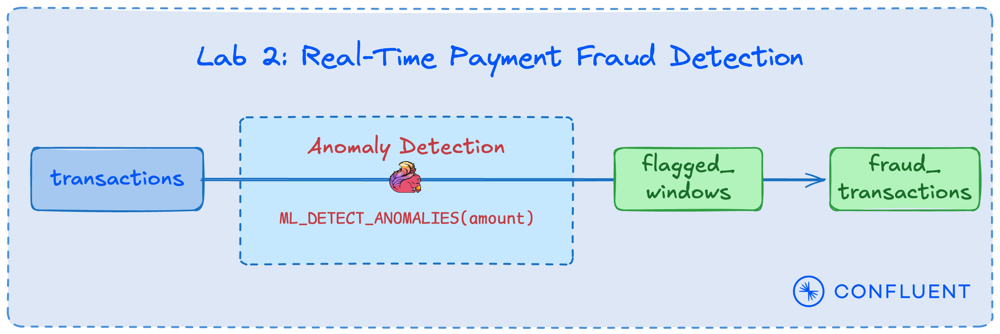

# Lab 2: Real-Time Payment Fraud Detection with `ML_DETECT_ANOMALIES`

This lab demonstrates a real-time payment fraud detection pipeline using the built-in `ML_DETECT_ANOMALIES` function.

Two SQL statements run **an independent ARIMA model per customer** over transaction amounts — one to score each
customer's spending windows, one to recover the offending transaction — and materialize a table of fraudulent payments
the moment they appear in the stream.

[Learn more about the built-in anomaly detection functions on Confluent Cloud for Apache Flink.](https://docs.confluent.io/cloud/current/ai/builtin-functions/detect-anomalies.html)

---

## Prerequisites

**Required accounts & credentials:**

[](https://www.confluent.io/get-started/)

<details>
<summary>Install the Prerequisities (Mac/Windows)</summary>

**Mac:**

```bash
brew install uv git python && brew tap hashicorp/tap && brew install hashicorp/tap/terraform && brew install --cask confluent-cli
```

**Windows:**

```powershell
winget install astral-sh.uv Git.Git Hashicorp.Terraform ConfluentInc.Confluent-CLI Python.Python
```

</details>

---

## Deploy the Demo

If you haven't cloned the repository yet, clone it first:

```bash
git clone https://github.com/confluentinc/quickstart-ai-ml-functions.git
cd quickstart-ai-ml-functions
```

Run the deployment script:

```bash
uv run deploy
```

> **Optional:** Register the project-scoped Confluent MCP server in Claude or Codex:
>
> ```bash
> uv run setup-mcp
> ```

This provisions the core Confluent Cloud environment, along with the `transactions` table — a real Kafka-backed stream
fed by a [Flink faker](https://docs.confluent.io/cloud/current/flink/how-to-guides/custom-sample-data.html) pipeline
that generates ~50 synthetic card transactions per second across 50 customers.



## Walkthrough

### Data Generation

The `transactions` topic streams ~50 payment records per second across 50 customers. Each row is a card transaction:
a `transaction_id`, the `customer_id`, the `merchant`, the `amount`, and a `transaction_ts`. Amounts normally fall in
the `$18`–`$480` range, but a small fraction (~0.13%) are **varied spike amounts between `$1,250` and `$8,900`** —
the fraud signal this lab detects.

To explore the source data, open a SQL workspace in the [Confluent Cloud Flink UI](https://confluent.cloud/go/flink),
select your environment and compute pool, and run the following query.

```sql
SELECT * FROM transactions LIMIT 10;
```

Example output:

| transaction_id | customer_id | merchant            | amount  | transaction_ts          |
| -------------- | ----------- | ------------------- | ------- | ----------------------- |
| 5bd84c3c-…     | CUST-0017   | Hahn-Predovic       | 75.25   | 2026-06-10 12:39:01.000 |
| 9bd56699-…     | CUST-0031   | Bergstrom Inc       | 4510.75 | 2026-06-10 12:39:01.000 |
| c1220339-…     | CUST-0008   | Kuhic and Sons      | 42.00   | 2026-06-10 12:39:02.000 |

### The Approach

ARIMA — the model behind `ML_DETECT_ANOMALIES` — expects an **evenly spaced time series**: one value per timestamp
per model. Raw transactions don't look like that (each customer's payments arrive at irregular moments), so feeding
raw events directly to the model produces noisy bounds and false alarms on ordinary transactions.

The fix is a standard streaming pattern: aggregate each customer's transactions into **15-second tumbling windows**,
then run one `ML_DETECT_ANOMALIES` model per customer on the windowed series. Two SQL statements handle the full
pipeline:

1. **`flagged_windows`** — aggregate into 15s windows, score with ARIMA, keep only anomalous windows
2. **`fraud_transactions`** — join flagged windows back to `transactions` to recover the offending payment

> **Why `MAX(amount)` per window?** Fraud here is a single oversized transaction. Averaging the window dilutes the
> signal: one `$1,250` charge among ~15 normal ones averages to only ~`$145` and can slip below the model's upper
> bound. Tracking the window's *largest* transaction means the model learns each customer's normal spending
> **ceiling** (~`$480`) — any single spike that breaks through it stands out immediately.

### 1. Create the `flagged_windows` Table

Aggregate each customer's transactions into 15-second tumbling windows, run `ML_DETECT_ANOMALIES` on the windowed
`max_amount` series, and keep only the windows where the model detected an anomaly. The result is persisted as a
[materialized table](https://docs.confluent.io/cloud/current/flink/concepts/dynamic-tables.html).

```sql
CREATE OR ALTER MATERIALIZED TABLE flagged_windows AS
WITH features AS (
  -- Aggregate each customer's transactions into evenly spaced 15s windows
  SELECT
    customer_id,
    window_start,
    window_end,
    window_time,
    MAX(amount) AS max_amount
  FROM TUMBLE(TABLE transactions, DESCRIPTOR(transaction_ts), INTERVAL '15' SECOND)
  GROUP BY customer_id, window_start, window_end, window_time
),
scored AS (
  -- One ARIMA model per customer over its windowed max-amount series
  SELECT
    customer_id,
    window_start,
    window_end,
    max_amount,
    ML_DETECT_ANOMALIES(
      CAST(max_amount AS DOUBLE), window_time,
      JSON_OBJECT(
        'minTrainingSize'      VALUE 10,
        'maxTrainingSize'      VALUE 24,
        'confidencePercentage' VALUE 99.0,
        'enableStl'            VALUE FALSE
      )
    ) OVER (
      PARTITION BY customer_id  -- one model per customer
      ORDER BY window_time
      RANGE BETWEEN UNBOUNDED PRECEDING AND CURRENT ROW
    ) AS anom
  FROM features
)
-- Keep only windows the model flagged (with a severity floor)
SELECT
  customer_id,
  window_start,
  window_end,
  max_amount,
  CAST(ROUND(anom.upper_bound, 2)    AS DOUBLE) AS model_upper_bound,
  CAST(ROUND(anom.forecast_value, 2) AS DOUBLE) AS model_forecast_value
FROM scored
WHERE CAST(max_amount AS DOUBLE) > anom.upper_bound
  AND max_amount > 500;
```

`ML_DETECT_ANOMALIES` returns a struct with these fields:

| Field            | Type      | Description                                                            |
|------------------|-----------|------------------------------------------------------------------------|
| `is_anomaly`     | BOOLEAN   | `TRUE` when the value falls outside the predicted confidence interval  |
| `forecast_value` | DOUBLE    | The model's predicted value for this timestamp                         |
| `upper_bound`    | DOUBLE    | Upper edge of the model's expected range                               |
| `lower_bound`    | DOUBLE    | Lower edge of the model's expected range                               |
| `actual_value`   | DOUBLE    | The observed value the model evaluated                                 |
| `rmse`           | DOUBLE    | Rolling root-mean-square error of recent predictions                   |
| `aic`            | DOUBLE    | Akaike Information Criterion of the current model fit                  |
| `timestamp`      | TIMESTAMP | The timestamp of the evaluated point                                   |

> [!NOTE]
>
> `minTrainingSize: 10` means each model needs 10 windows (~2.5 minutes) before it starts scoring, and
> `maxTrainingSize: 24` keeps training data fresh so a past spike ages out (~6 minutes) instead of skewing
> the model's bounds. Each ARIMA model trains independently per customer — 50 concurrent models from one statement.
>
> The `max_amount > 500` **severity floor** guards against the first couple minutes of scoring, when a model trained
> on only ~10 points can emit unstable bounds. It costs nothing: an all-normal window's largest transaction never
> exceeds `$480`, while every spike is `> $1,250` — so the floor silences early-model noise without ever masking
> real fraud. (Lab 1 uses the same pattern with its vibration floor.)
>
> Expect a delay of **~3 minutes** before the first anomalies appear.

Peek at what the model is flagging — each row is one suspicious window (not yet a transaction):

```sql
SELECT * FROM flagged_windows;
```

### 2. Create the `fraud_transactions` Table

`flagged_windows` tells us *which 15-second window* for *which customer* contained a spike. This step joins those
windows back to `transactions` to recover the **actual offending payment** — the one whose amount equals the
window's flagged `max_amount` — with its `transaction_id` and `merchant` intact.

The result is persisted as a
[materialized table](https://docs.confluent.io/cloud/current/flink/concepts/dynamic-tables.html) where **every row
is one fraudulent transaction**, ready for dashboards, alerting jobs, or sinks like Snowflake, BigQuery, Databricks,
or OpenSearch.

```sql
CREATE OR ALTER MATERIALIZED TABLE fraud_transactions AS
SELECT
  p.transaction_id,
  p.customer_id,
  p.merchant,
  p.amount,
  p.transaction_ts,
  f.max_amount         AS window_max_amount,
  f.model_upper_bound,
  f.model_forecast_value
FROM flagged_windows AS f
JOIN transactions AS p
  ON p.customer_id = f.customer_id
 AND p.transaction_ts >= f.window_start
 AND p.transaction_ts <  f.window_end
WHERE p.amount = f.max_amount;
```

To see the fraudulent transactions:

```sql
SELECT * FROM fraud_transactions;
```

Example output (every row is one spike payment — note the varied amounts and the model bound it broke):

| transaction_id | customer_id | merchant                     | amount  | window_max_amount | model_upper_bound | model_forecast_value |
|----------------|-------------|------------------------------|---------|-------------------|-------------------|----------------------|
| 7ee83da1-…     | CUST-0005   | Kirlin, Ziemann and Dickens  | 1250.75 | 1250.75           | 567.87            | 412.92               |
| 560c1052-…     | CUST-0022   | Lakin, Kiehn and Greenfelder | 3640.15 | 3640.15           | 733.23            | 448.65               |
| c9bab753-…     | CUST-0043   | Huels LLC                    | 4510.75 | 4510.75           | 1055.81           | 510.02               |
| 92b0d667-…     | CUST-0039   | Glover Group                 | 7720.50 | 7720.50           | 3659.20           | 342.30               |

🎉 **Nice work — amount-spike fraud is flowing in real time**, one model per customer, from two short statements you
can read top to bottom.

### 3. 🎯 Challenge: Which Customers Are Getting Hit the Hardest? 💸

**Mission brief.** Fraud ops just pinged you on Slack: *"Which customers are bleeding the most? We need to call them
now."*

You have `fraud_transactions` streaming live. Build one materialized table named `fraud_by_customer` that answers two
questions per customer:

1. **How many** fraudulent transactions?
2. **How much** money is on the line?

Start from this skeleton and fill in `<YOUR_LOGIC>`:

```sql no-parse
CREATE OR ALTER MATERIALIZED TABLE fraud_by_customer AS
SELECT
  <YOUR_LOGIC>
FROM fraud_transactions
GROUP BY customer_id;
```

<details>
<summary>Stuck? Peek at a hint</summary>

- Two aggregate functions will get you the whole way there: `COUNT(*)` and `SUM(amount)`
- Want clean 2-decimal totals? `CAST(ROUND(SUM(amount), 2) AS DOUBLE)`

</details>

## Navigation

- **← Back to Overview**: [Main README](./README.md)
- **← Previous Lab**: [Lab 1](./Lab1-Walkthrough.md)
- **🧹 Cleanup**: Run `uv run destroy`
