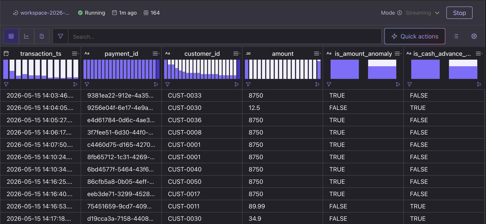
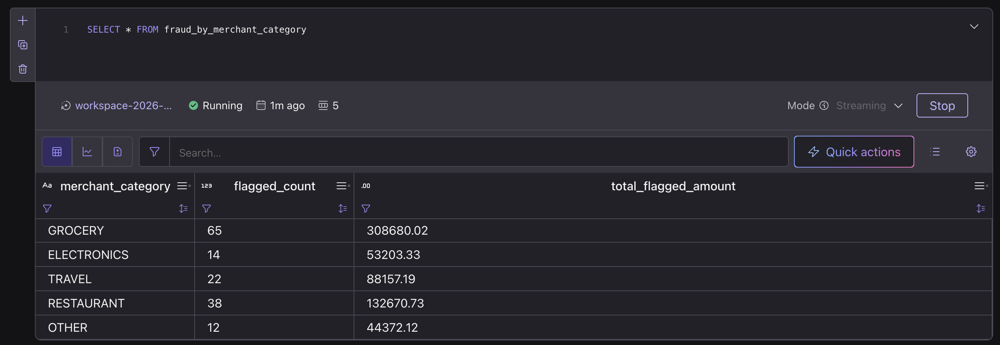

# Lab 2: Real-Time Payment Fraud Detection with `ML_DETECT_ANOMALIES`

This lab demonstrates a real-time payment fraud detection pipeline using the built-in `ML_DETECT_ANOMALIES` function.

A single SQL statement runs **two independent ARIMA models per customer** simultaneously — one on transaction amount, one
on cash advance frequency — flagging unusual activity the moment it appears in the stream.

[Learn more about the built-in anomaly detection functions on Confluent Cloud for Apache Flink.](https://docs.confluent.io/cloud/current/ai/builtin-functions/detect-anomalies.html)

## Deploy the Demo

If you haven't cloned the repository yet, clone it first:

```bash
git clone https://github.com/confluentinc/quickstart-ai-ml-functions.git
cd quickstart-ai-ml-functions
```

Run the deployment script:

> [!CAUTION]
> You must be logged in to the Confluent CLI (`confluent login`) before running the deploy command.

```bash
uv run deploy lab2
```

This provisions the core Confluent Cloud environment, along with the `payments` source table, which uses the [Flink faker connector](https://docs.confluent.io/cloud/current/flink/how-to-guides/custom-sample-data.html) to generate ~10 synthetic payment records per second across 50 customers.


## Walkthrough

### Data Generation

The `payments` topic streams ~10 payment records per second across 50 customers. It contains two fraud signals that `ML_DETECT_ANOMALIES` is designed to catch:

- **Transaction size spikes:** ~0.5% of transactions have an amount of `$8,750` (vs. a normal range of `$12.50`–
  `$110.75`)
- **Cash advance spikes:** `CASH_ADVANCE` transaction type appears at ~10% average baseline; per-customer bursts above that
  baseline are flagged

To explore the source data, open a SQL workspace in the [Confluent Cloud Flink UI](https://confluent.cloud/go/flink), select your environment and compute pool, and run the following query.

```sql
SELECT * FROM payments LIMIT 10;
```

Example output:

| payment_id | customer_id | amount  | transaction_type | transaction_ts          |
| -------------- | ----------- | ------- | ---------------- | ----------------------- |
| txn-00042      | cust-017    | 34.50   | PURCHASE         | 2026-04-01 12:39:01.000 |
| txn-00043      | cust-031    | 8750.00 | PURCHASE         | 2026-04-01 12:39:01.000 |
| txn-00044      | cust-017    | 22.75   | CASH_ADVANCE     | 2026-04-01 12:39:02.000 |
| txn-00045      | cust-008    | 67.10   | PURCHASE         | 2026-04-01 12:39:02.000 |

### 1. Create the `payments_flagged` Table

In the [Flink compute pool](https://confluent.cloud/go/flink), run two `ML_DETECT_ANOMALIES` models **per customer** — one on transaction amount, one on cash advance frequency. Any
transaction where either model fires an anomaly is emitted to `payments_flagged`.

The result is persisted as a [materialized table](https://docs.confluent.io/cloud/current/flink/concepts/dynamic-tables.html), so downstream consumers can query the latest fraud-flagged transactions directly.

```sql
CREATE OR ALTER MATERIALIZED TABLE payments_flagged AS
WITH with_anom AS (
  SELECT
    p.*,

    -- Model 1: flag unusually large transaction amounts per customer
    ML_DETECT_ANOMALIES(
      CAST(amount AS DOUBLE), transaction_ts,
      JSON_OBJECT(
        'minTrainingSize'      VALUE 10,
        'confidencePercentage' VALUE 99.0,
        'enableStl' VALUE FALSE
      )
    ) OVER (
      PARTITION BY customer_id  -- one model per customer
      ORDER BY transaction_ts
      RANGE BETWEEN UNBOUNDED PRECEDING AND CURRENT ROW
    ) AS amount_anom,

    -- Model 2: flag abnormal cash advance frequency per customer
    ML_DETECT_ANOMALIES(
      CASE WHEN transaction_type = 'CASH_ADVANCE' THEN 1.0 ELSE 0.0 END, transaction_ts,
      JSON_OBJECT(
        'minTrainingSize'      VALUE 10,
        'confidencePercentage' VALUE 99.0,
        'enableStl' VALUE FALSE
      )
    ) OVER (
      PARTITION BY customer_id
      ORDER BY transaction_ts
      RANGE BETWEEN UNBOUNDED PRECEDING AND CURRENT ROW
    ) AS cash_anom

  FROM payments AS p
)
SELECT
  p.*,
  COALESCE(CAST(p.amount AS DOUBLE) > p.amount_anom.upper_bound, FALSE) AS is_amount_anomaly,
  COALESCE(
    (CASE WHEN p.transaction_type = 'CASH_ADVANCE' THEN 1.0 ELSE 0.0 END) > p.cash_anom.upper_bound,
    FALSE
  ) AS is_cash_advance_anomaly
FROM with_anom AS p
WHERE CAST(p.amount AS DOUBLE) > p.amount_anom.upper_bound
   OR (CASE WHEN p.transaction_type = 'CASH_ADVANCE' THEN 1.0 ELSE 0.0 END) > p.cash_anom.upper_bound;
```

`ML_DETECT_ANOMALIES` returns a struct with these fields:

| Field         | Type    | Description                                                           |
|---------------|---------|-----------------------------------------------------------------------|
| `is_anomaly`  | BOOLEAN | `TRUE` when the value falls outside the predicted confidence interval |
| `upper_bound` | DOUBLE  | Upper edge of the model's expected range                              |
| `lower_bound` | DOUBLE  | Lower edge of the model's expected range                              |
| `score`       | DOUBLE  | Normalized anomaly score (higher = more anomalous)                    |

The WHERE clause filters to only rows where at least one model detected an anomaly. The SELECT adds boolean columns so
downstream consumers can tell which signal triggered the alert.

> [!NOTE]
>
> `minTrainingSize: 10` is set low so models warm up quickly for demo purposes. Each ARIMA model trains independently
> per customer — with 50 customers that's 100 concurrent models from a single SQL statement.
>
> Expect a delay of **2–3 minutes** before the first anomalies appear.

To see the fraud detection results:

```sql
SELECT * FROM payments_flagged;
```

Example output:



🎉 **Nice work — that's the core fraud detection job done.** Anomalies are flowing in real time. Now let's do some real-time stream processing on top: reshape the data so it's ready for reporting, dashboards, and other downstream use cases.

### 2. Flatten the Anomaly Struct Fields

`payments_flagged` keeps the `amount_anom` and `cash_anom` structs returned by `ML_DETECT_ANOMALIES`. Flatten them into top-level columns so downstream consumers — dashboards, alerting jobs, sinks like Snowflake, BigQuery, Databricks, or OpenSearch — can read the bounds and forecast values without struct navigation.

```sql
CREATE OR ALTER MATERIALIZED TABLE payments_flagged_flat AS
SELECT
  payment_id,
  customer_id,
  transaction_ts,
  amount,
  transaction_type,
  merchant_name,
  merchant_category,
  payment_method,
  card_type,
  channel,
  country_code,
  is_amount_anomaly,
  CAST(ROUND(amount_anom.upper_bound, 2) AS DOUBLE) AS amount_upper_bound,
  amount_anom.forecast_value                        AS amount_forecast_value,
  is_cash_advance_anomaly,
  cash_anom.upper_bound                             AS cash_upper_bound,
  cash_anom.forecast_value                          AS cash_forecast_value
FROM payments_flagged;
```

Query the flattened results:

```sql
SELECT * FROM payments_flagged_flat;
```

Example output:

| payment_id | customer_id | amount  | transaction_type | is_amount_anomaly | amount_upper_bound | amount_forecast_value | is_cash_advance_anomaly | cash_forecast_value |
|------------|-------------|---------|------------------|-------------------|--------------------|-----------------------|-------------------------|---------------------|
| pay-00043  | CUST-0031   | 8750.00 | PURCHASE         | TRUE              | 142.80             | 58.92                 | FALSE                   | 0.08                |
| pay-00107  | CUST-0014   | 22.50   | CASH_ADVANCE     | FALSE             | 118.45             | 61.30                 | TRUE                    | 0.11                |

### 3. 🎯 Challenge: Where Is the Fraud Hitting Hardest? 💸

**Mission brief.** Fraud ops just pinged you on Slack: *"Which merchant categories are bleeding the most money? We need this on the dashboard by EOD."*

You have `payments_flagged_flat` streaming live. Build one materialized table named `fraud_by_merchant_category` that answers two questions per merchant category:

1. **How many** flagged transactions?
2. **How much** money is on the line?

Start from this skeleton and fill in `<YOUR_LOGIC>`:

```sql
CREATE OR ALTER MATERIALIZED TABLE fraud_by_merchant_category AS
SELECT
  <YOUR_LOGIC>
```

When you nail it, your output should look like this:



<details>
<summary>Stuck? Peek at a hint</summary>

- Two aggregate functions will get you the whole way there
- Don't forget the `GROUP BY`
- Want the clean 2-decimal totals from the screenshot? `CAST(ROUND(..., 2) AS DOUBLE)`

</details>

## Navigation

- **← Back to Overview**: [Main README](./README.md)
- **← Previous Lab**: [Lab 1](./LAB1-Walkthrough.md)
- **🧹 Cleanup**: Run `uv run destroy`
